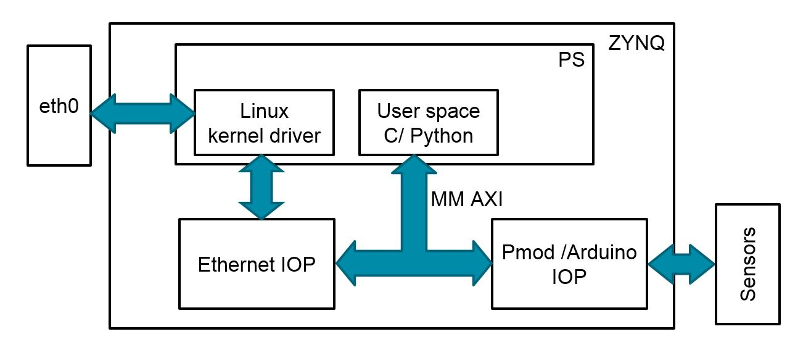

# PYNQ-Networking
PYNQ networking overlay enables networking capabilities from PL on the board.
Traditionally, the PS on ZYNQ board connects to the Ethernet port, while this 
overlay also bridges the PL on ZYNQ to the Ethernet port. MQTT-SN is 
implemented on this overlay, leveraging the `scapy` python library.



## Getting Started
On the latest PYNQ image, use the following command in a terminal.

```
sudo pip3.6 install --upgrade git+https://github.com/Xilinx/PYNQ-Networking.git
sudo reboot
```

After the setup, the notebook folder will be populated, and users can try
the demo there. Users do not have to run any additional steps.

*Note: For completeness, the following few sections introduce what have been done
to the PYNQ image. These steps do not need to be performed
by users, since they will be taken care of when this package is being installed.*

## Wily Release
For Ubuntu 15.10, please make sure the file
`/etc/apt/sources.list.d/multistrap-wily.list` looks like the following:

```
deb [arch=armhf] http://old-releases.ubuntu.com/ubuntu wily universe main
deb-src http://old-releases.ubuntu.com/ubuntu wily universe main
```

And run `apt-get update` before installing any package.

users can safely ignore this step if they are on the latest PYNQ image.
(For example, PYNQ image v2.1 deploys Ubuntu 16.04.)

## Boot Files
This package requires the boot files to be compatible. 
For example, the device tree must have the following patch:

```
/ {
	chosen {
		bootargs = "console=ttyPS0,115200 root=/dev/mmcblk0p2 rw earlyprintk rootfstype=ext4 rootwait devtmpfs.mount=1 uio_pdrv_genirq.of_id=\"generic-uio\"";
		linux,stdout-path = "/amba@0/serial@E0001000";
	};

	amba {

		fabric@40000000 {
			compatible = "generic-uio";
			reg = <0x40000000 0x10000>;
			interrupt-parent = <&intc>;
			interrupts = <0x0 0x1d 0x4>;
		};

		ethernet@e000b000 {
			phy-handle = <&ethernet_phy>;
                        ethernet_phy: ethernet-phy@1{
				reg = <1>;
			};
		};

		slcr@f8000000 {
			clkc@100 {
				fclk-enable = <0xf>;
			};
		};
	};


	xlnk {
		compatible = "xlnx,xlnk-1.0";
		clock-names = "xclk0", "xclk1", "xclk2", "xclk3";
		clocks = <&clkc 0xf &clkc 0x10 &clkc 0x11 &clkc 0x12>;
	};
	usb_phy0: phy0 {
		compatible = "ulpi-phy";
		#phy-cells = <0>;
		reg = <0xe0002000 0x1000>;
		view-port = <0x170>;
		drv-vbus;
	};
   
};

&usb0 {
	usb-phy = <&usb_phy0>;
};
```
The ethernet entry must have bridging enabled as above.

Again, if you are on the latest PYNQ image, you do not have
to do this step.

## Installing Packages
There are several packages installed during the setup:

```shell
apt-get install tcpdump iptables ebtables bridge-utils
pip3.6 install scapy-python3 wurlitzer pytest-runner paho-mqtt netifaces
```
This step does not need to be run by the users, since it
has been taken care of by the installation process.

## Modifying `eth0` Port
Users can modify the `eth0` port on Linux 
(`/etc/network/interfaces.d/eth0`). An example of the modified file is stored
in `interfaces.d` folder of this repository.

This step will be performed automatically during the installation process. 
A backup of the original file is also produced in the same directory 
(`/etc/network/interfaces.d/`).
